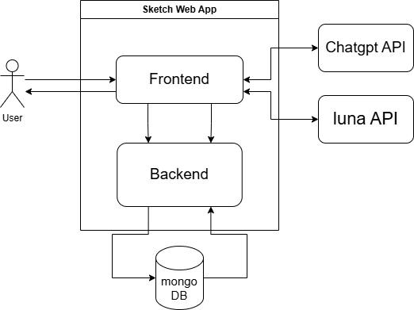

## 3. Architecture Overview
### 시스템 컨텍스트 (System Context)


---

요소 정의
**User (사용자)**:
역할: 애플리케이션의 최종 사용자로, 스케치 생성, 편집, 저장, 불러오기 등의 작업을 요청합니다.

**WebOS API**:
역할: WebOS 플랫폼의 핵심 API로, 시스템 리소스 상태(CPU, 메모리 등)를 제공합니다.

**AI Server**:
역할: AI 기반의 스케치 추천, 제목 생성, 화풍 변환 등의 기능을 제공합니다.
통신 방식: 프론트엔드를 통해 JSON 기반의 요청 및 응답으로 통신합니다.

**MongoDB**:
역할: 사용자 계정 정보 및 스케치 데이터를 관리하는 데이터베이스입니다.
기능: 백엔드와 통신하여 데이터 저장, 검색, 삭제 작업을 수행합니다.

**Sketch Web Application**:
**Frontend**:
역할: WebOS 환경에서 동작하며, 사용자의 입력을 수집하고 백엔드에 전달합니다.
주요 기능: 스케치 도구 제공, 사용자 작업 관리.
**Backend**:
역할: Express.js 기반으로, API 요청 처리 및 외부 시스템과의 통신을 담당합니다.
주요 기능: 데이터 저장 및 AI 서버와의 연동.

### Static Perspective

### 주요 모듈과 역할

**Frontend**

---

### **API 및 주요 기능 정의**

#### **1. 캔버스 초기화 및 설정**
- **Canvas 생성 및 초기화:**
  - `fabric.Canvas('canvas', options)`: 캔버스를 초기화하며, 기본 배경색과 크기를 설정.
- **Canvas 기본 설정:**
  - `canvas.backgroundColor`: 캔버스 배경색 설정.
  - `canvas.isDrawingMode`: 캔버스의 드로잉 모드 활성화 여부.

---

#### **2. 도구 및 브러시 설정**
- **그리기 기능 제공**
  - `canvas.freeDrawingBrush`: 브러시 설정 (PencilBrush, CircleBrush, SprayBrush 등).
  - `freeDrawingBrush.color`: 브러시 색상 설정.
  - `freeDrawingBrush.width`: 브러시 두께 설정.
  - `freeDrawingBrush.shadow`: 브러시 그림자 추가 (`fabric.Shadow` 사용).
  - 사용자 선택 도구:
    - `Btn_penColor`, `Btn_penWidth`, `Btn_penType`: 브러시 색상, 두께, 타입 변경.

---

#### **3. 도형 추가 및 사용자 작업**
- **새로운 도형 추가 및 삭제**
  - `Draw_Square`, `Draw_Triangle`, `Draw_Circle`, `Draw_Line`, `Draw_Polygon`: 마우스 이벤트로 다양한 도형을 그릴 수 있는 함수.
  - `canvas.add()`: 새로 생성된 객체를 캔버스에 추가.
  - `canvas.getActiveObject()`: 사용자가 선택한 객체를 가져옴.
  - `canvas.remove(obj)`: 선택된 객체 삭제.
  - `Btn_Delete`: 활성화된 객체 삭제 버튼.

---

#### **4. 스케치 저장, 불러오기, 내보내기**
- **스케치 저장**
  - `canvas.toJSON()`: 현재 캔버스 상태를 JSON 형식으로 저장.
  - `SavePainting(Painting)`: JSON 데이터를 서버에 저장.
- **스케치 불러오기**
  - `canvas.loadFromJSON(json)`: 저장된 JSON 데이터를 캔버스에 로드.
  - `LoadPaintingbyId(Painting_id)`: ID로 특정 스케치 불러오기.
  - `canvas.toDataURL()`: 캔버스를 PNG 이미지로 내보내기.
  - `Btn_saveCanvas`, `Btn_loadCanvas`: 저장 및 불러오기 버튼.

---

#### **5. 작업 관리 및 사용자 경험 개선**
- **작업 복사, 실행 취소 및 재실행**
  - `Btn_Copy`: 현재 선택된 객체 복사 및 붙여넣기.
  - `canvas.getActiveObject().clone(callback)`: 객체 복제.
  - `Undo`: 이전 작업 상태로 되돌림.
  - `Redo`: 실행 취소된 작업을 복원.
- **캔버스 초기화:**
  - `canvas.clear()`: 모든 객체 및 설정 초기화.
  - `clearCanvas()`: 초기화 버튼.

---

#### **6. AI 생성 이미지 및 화풍 변경**
- **AI 생성 이미지 추가**
  - **API 호출:**
    - OpenAI DALL-E 모델을 호출해 Base64 이미지 생성.
    - `axios.post`를 사용하여 OpenAI API 호출.
    - 응답 데이터: `response.data[0].b64_json`을 Base64 형식으로 받아 캔버스에 추가.
  - **Fabric.js와 연계:**
    - `fabric.Image.fromURL(dataUrl)`: Base64 이미지 데이터를 캔버스에 추가.
  - **관련 버튼:**
    - `Btn_AiTool`: AI 프롬프트 입력 및 결과 이미지 생성 버튼.
    - `Draw_Image`: AI 이미지를 캔버스에 추가.

---

#### **7. 사용자 계정 및 작업 연동**
- **계정 관리:**
  - `CreateAccount`, `GetUserbyName`, `UpdateAccount`: 사용자 계정 생성 및 수정.
- **작업 관리:**
  - `SavePainting`, `LoadPaintingbyUser`, `UpdatePainting`, `DeletePainting`: 사용자의 스케치 작업 저장, 불러오기, 업데이트, 삭제.

---

### **주요 버튼 및 컴포넌트**
- **`Btn_penColor`, `Btn_penWidth`, `Btn_penType`:** 브러시 도구 설정 버튼.
- **`Btn_AddCanvas`, `Btn_saveCanvas`, `Btn_loadCanvas`:** 캔버스 추가, 저장, 불러오기 버튼.
- **`Btn_AiTool`:** AI 생성 이미지 요청 및 추가.
- **`Btn_Copy`, `Btn_Undo`, `Btn_Redo`:** 객체 복사, 실행 취소 및 재실행.
- **`Btn_Delete`:** 선택된 객체 삭제.

---

### **FR 요구사항 기반 주요 API 정의**

| 요구사항  | API/기능                                      | 설명                                                          |
|-----------|-----------------------------------------------|---------------------------------------------------------------|
| **FR02-1**| `canvas.add()`, `canvas.clear()`, `canvas.toJSON()` | 새로운 작업 추가, 삭제, 저장.                                 |
| **FR02-2**| `canvas.freeDrawingBrush`, `freeDrawingBrush.color` | 다양한 브러시 도구 및 색상, 굵기, 그림자 설정 제공.           |
| **FR02-4**| `canvas.loadFromJSON()`, `SavePainting()`      | 스케치 데이터를 JSON으로 저장 및 불러오기.                     |
| **FR02-5**| `canvas.toDataURL()`, `Btn_saveCanvas`         | 스케치를 PNG로 내보내기.                                      |
| **FR03**  | `fabric.Image.fromURL()`, `Draw_Image()`       | AI 생성 이미지 추가 및 텍스트 인식.                             |
| **작업 관리** | `Btn_Copy`, `Btn_Undo`, `Btn_Redo`, `Btn_Delete` | 복사, 실행 취소, 재실행, 삭제.                                 |

---

**Backend**

- **주요 API 및 기능**:

#### **1. 시스템 정보 조회**
- **시스템 CPU 및 메모리 정보 제공**:
  - `getProcStats()`: Linux 시스템의 `/proc/stat`와 `/proc/meminfo` 파일을 통해 CPU 사용량 및 메모리 정보를 수집.
  - `os.totalmem()` 및 `os.freemem()`: 비 Linux 시스템의 메모리 정보를 반환.
- **Luna API 통합**:
  - `getLunaProcStats(callback)`: `Luna API`를 호출하여 프로세스 정보를 수집.
  - `getLunaUnitList(callback)`: `Luna API`를 호출하여 서비스 목록을 수집.
- **Mock 데이터 제공**:
  - Linux가 아닌 환경에서는 Mock 데이터를 반환하여 테스트 가능.

---

#### **2. S3를 이용한 이미지 및 텍스트 업로드**
- **이미지 업로드**:
  - `POST /api/paintings/upload`: 사용자가 업로드한 이미지를 S3에 저장하고, MongoDB에 메타데이터를 저장.
- **텍스트 업로드**:
  - `POST /api/paintings/upload-text`: 텍스트 데이터를 S3에 저장하고, MongoDB에 URL 저장.
  - `POST /api/paintings/upload-base64-as-text`: Base64 데이터를 텍스트로 변환하여 S3에 저장.

---

#### **3. 그림 관리 API**
- **그림 조회**:
  - `GET /api/paintings/`: 모든 그림 데이터를 조회.
  - `GET /api/paintings/:id`: 특정 ID로 그림 데이터 조회.
  - `GET /api/paintings/user/:userId`: 특정 사용자 ID로 그림 조회.
  - `GET /api/paintings/user/:userId/sorted`: 사용자의 그림 데이터를 `updatedAt` 기준으로 정렬하여 반환.
- **그림 생성 및 수정**:
  - `POST /api/paintings/`: 새로운 그림 데이터를 MongoDB에 저장.
  - `PUT /api/paintings/:id`: 특정 ID의 그림 데이터를 업데이트.
- **그림 삭제**:
  - `DELETE /api/paintings/:id`: 특정 ID의 그림 데이터를 삭제.

---

#### **4. 사용자 관리 API**
- **사용자 조회**:
  - `GET /api/users/`: 모든 사용자 데이터를 조회.
  - `GET /api/users/email/:email`: 이메일로 특정 사용자 데이터 조회.
  - `GET /api/users/username/:username`: 사용자 이름으로 사용자 데이터 조회.
- **사용자 생성 및 수정**:
  - `POST /api/users/`: 새로운 사용자 데이터를 MongoDB에 추가.
  - `PUT /api/users/:id`: 특정 ID의 사용자 데이터를 업데이트.
- **사용자 삭제**:
  - `DELETE /api/users/:id`: 특정 ID의 사용자 데이터를 삭제.

---

### **주요 API 정의**

| 엔드포인트                                   | 메서드  | 설명                                            |
|---------------------------------------------|---------|-------------------------------------------------|
| **`/api/system-info`**                      | GET     | CPU, 메모리 정보 및 프로세스, 서비스 목록 제공. |
| **`/api/paintings/`**                       | GET     | 모든 그림 데이터를 반환.                        |
| **`/api/paintings/:id`**                    | GET     | 특정 그림 데이터를 ID로 조회.                  |
| **`/api/paintings/user/:userId`**           | GET     | 특정 사용자의 그림 데이터를 반환.               |
| **`/api/paintings/user/:userId/sorted`**    | GET     | 사용자 그림 데이터를 `updatedAt` 기준 정렬.     |
| **`/api/paintings/upload`**                 | POST    | 이미지 업로드 및 MongoDB에 저장.               |
| **`/api/paintings/upload-text`**            | POST    | 텍스트 데이터를 업로드하고 URL 저장.            |
| **`/api/paintings/upload-base64-as-text`**  | POST    | Base64 데이터를 업로드하고 URL 저장.            |
| **`/api/paintings/`**                       | POST    | 새로운 그림 데이터를 생성.                     |
| **`/api/paintings/:id`**                    | PUT     | 특정 ID의 그림 데이터를 수정.                  |
| **`/api/paintings/:id`**                    | DELETE  | 특정 ID의 그림 데이터를 삭제.                  |
| **`/api/users/`**                           | GET     | 모든 사용자 데이터를 반환.                     |
| **`/api/users/email/:email`**               | GET     | 이메일로 사용자 조회.                          |
| **`/api/users/username/:username`**         | GET     | 사용자 이름으로 사용자 조회.                   |
| **`/api/users/`**                           | POST    | 새로운 사용자 데이터를 생성.                   |
| **`/api/users/:id`**                        | PUT     | 특정 ID의 사용자 데이터를 수정.                |
| **`/api/users/:id`**                        | DELETE  | 특정 ID의 사용자 데이터를 삭제.                |

---

**MongoDB**

#### **1. 사용자 관리**
- **사용자 생성**:
  - `createUser(username, email, password)`: 사용자 정보를 데이터베이스에 저장하며 비밀번호는 bcrypt를 사용하여 해시 처리.
  - 주요 필드:
    - `username`: 사용자 이름.
    - `email`: 이메일 주소.
    - `password`: 해시 처리된 비밀번호.
    - `createdAt`, `updatedAt`: 생성 및 수정 시간 기록.

---

#### **2. 그림 관리**
- **그림 저장**:
  - `savePainting(userId, title, description, imageUrl)`: 사용자 ID와 그림 정보를 데이터베이스에 저장.
  - 주요 필드:
    - `userId`: 그림을 업로드한 사용자의 ID.
    - `title`: 그림 제목.
    - `description`: 그림 설명.
    - `imageUrl`: 그림의 URL.
    - `createdAt`, `updatedAt`: 생성 및 수정 시간 기록.

- **사용자 그림 조회**:
  - `getUserPaintings(userId)`: 특정 사용자의 모든 그림 데이터를 조회.
  - 반환 데이터:
    - 사용자가 업로드한 모든 그림의 정보 (제목, 설명, 이미지 URL 등).

- **그림 삭제**:
  - `deletePainting(paintingId)`: 특정 그림 ID를 사용하여 데이터베이스에서 그림 데이터를 삭제.

---

#### **3. 파일 업로드 (AWS S3 통합)**
- **이미지 업로드 및 URL 저장**:
  - `uploadImageToS3(file)`: AWS S3에 파일을 업로드하고 생성된 URL을 반환.
  - 주요 동작:
    - 파일을 S3 버킷의 `images/` 디렉토리에 저장.
    - 저장된 파일의 공개 접근을 허용 (`public-read` 권한).
    - 반환 데이터: S3에서 생성된 파일 URL.

---

### **주요 API 정의**

| 기능                | 메서드/함수                    | 설명                                            |
|---------------------|-------------------------------|------------------------------------------------|
| **사용자 생성**      | `createUser(username, email, password)` | 사용자 정보를 데이터베이스에 저장하며 비밀번호 해시 처리. |
| **그림 저장**        | `savePainting(userId, title, description, imageUrl)` | 사용자 ID와 그림 정보를 데이터베이스에 저장.     |
| **사용자 그림 조회**  | `getUserPaintings(userId)`    | 특정 사용자의 모든 그림 데이터를 조회.          |
| **그림 삭제**        | `deletePainting(paintingId)`  | 그림 ID를 사용하여 데이터베이스에서 삭제.        |
| **파일 업로드**       | `uploadImageToS3(file)`       | AWS S3에 파일 업로드 후 URL 반환.               |

---


### Dynamic Perspective

#### FR01: 계정 관리  
설명: 사용자가 스케치 애플리케이션에 로그인하고, 계정이 없을 경우 새로운 계정을 생성할 수 있도록 하는 기능.

주요 actor
- 사용자: 스케치 애플리케이션에 로그인하고 계정을 관리하는 개인.

사전 조건
- 애플리케이션이 정상적으로 실행 중이어야 함.
- 사용자는 계정이 있어야 로그인할 수 있으며, 없을 경우 계정을 새로 생성해야 함.

후 조건
- 계정 생성이 완료되면 사용자 정보를 저장하고, 사용자는 새로운 계정으로 로그인할 수 있음.
- 로그인에 성공한 사용자는 사용자 모드에 따라서 애플리케이션의 기능 사용에 제한이 있을 수 있음.

#### 기본 흐름 (주 시나리오)
1. 사용자가 애플리케이션을 실행하고 "프로필 선택" 화면으로 이동.
2. 본인의 프로필을 누르고 그에 해당하는 비밀번호를 입력.
3. 시스템이 입력된 사용자 이름과 비밀번호를 확인.
4. 시스템이 사용자의 로그인 정보를 확인한 후, 사용자를 애플리케이션에 로그인.
5. 시스템은 사용자에게 저장되어 있는 스케치 목록을 제공.
6. 사용자는 애플리케이션의 계정 관련 기능(계정 삭제, 비밀번호 변경 등)을 사용할 수 있음.

#### 대체 흐름 (예외 시나리오)

A. 계정이 없는 경우 - 새로운 프로필 생성
1. 기본 흐름 2에서 사용자는 새로운 프로필 생성 버튼을 누름.
2. 시스템은 계정 생성 화면을 표시하고 사용자 이름, 비밀번호, 비밀번호 확인, 사용자 모드를 입력 받음.
- 비밀번호 4자리 이상 입력하시오
- 아래 사용자 모드에 대한 간단한 안내
(예: 키즈모드의 경우 일부 AI기능이 제한될 수 있습니다)
- 일반/키즈 둘 중 하나로 고르는 기능 (처음에는 일반모드로 선택되어 있음)
2. 사용자가 모든 입력을 마칩니다.
3. 시스템이 입력된 정보의 유효성을 검증.
   - 예: 프로필 이름의 중복여부, 비밀번호 최소 길이 확인, 비밀번호 확인과 일치 여부
6. 정보가 유효하면, 시스템은 새로운 계정을 생성하고, 사용자 정보를 데이터베이스에 저장.
7. 계정 생성이 완료되면 시스템이 사용자에게 성공 메시지를 표시하고, "프로필 선택" 화면으로 돌아감.
8. 사용자는 새로 생성한 계정으로 로그인할 수 있음.

A-1 프로필 생성을 취소하는 경우
1. 대체 흐름 A.2에서 사용자가 아래 취소버튼을 누름.
2. 시스템은 “프로필 선택” 화면으로 돌아감.

A-2 정보의 유효성 검증을 실패한 경우
1. 대체 흐름 A.3에서 프로필의 이름이 중복된걸 확인함
- “이미 존재하는 사용자 이름입니다.” 메시지를 출력하고 다시 입력 받기
2. 비밀번호 최소 길이를 위반함
- “4자리 이상의 비밀번호를 입력해 주세요.” 메시지를 출력하고 다시 입력 받기
3. 비밀번호 확인과 일치하지 않음
- “비밀번호가 일치하지 않습니다” 메시지를 출력하고 다시 입력 받기

A-3 프로필 생성에 오류가 발생한 경우
1. 대체 흐름 A.6에서 생성에 오류가 발생
2. Error 메시지를 출력하고 다시 “프로필 선택” 화면으로 돌아옴

B. 잘못된 비밀번호 입력
1. 기본 흐름 3에서 시스템이 입력된 비밀번호가 틀리면 "잘못된 비밀번호입니다."라는 메시지를 표시하고 “프로필 선택”화면으로 돌아옴

C. 계정 삭제
1. 기본 흐름6에서 사용자가 “계정 삭제” 버튼을 클릭
2. 시스템은 “해당 계정을 삭제하시겠습니까?” 메시지를 출력
- 아래 프로필의 스케치들이 전부 삭제된다는 경고 메시지도 출력
3. 확인 버튼을 누름
- 계정이 데이터베이스에서 삭제 되고 프로필 생성 화면으로 돌아옴
4. 취소 버튼을 누름
- 프로필의 스케치 목록 화면으로 돌아옴

D. 계정 비밀번호 변경
1. 기본 흐름6에서 사용자가 비밀번호 변경 버튼을 클릭
2. 시스템은 비밀번호 변경 메시지를 띄우고 새 비밀번호, 새 비밀번호 확인을 입력받음
3. 비밀번호 양식에 맞춰서 사용자가 입력 후 확인
4. 비밀번호 유효성 검사 후 “비밀번호가 성공적으로 변경되었습니다”를 출력
5. 사용자가 확인 버튼을 누르면 프로필 스케치 목록으로 돌아옴

---

**FR02-1, 2-6 : 새로운 스케치 생성, 저장 및 삭제**

설명: 사용자가 새로운 스케치를 생성하고, 작업 후 스케치를 저장하거나 필요에 따라 삭제할 수 있도록 하는 기능

주요 액터  
- 사용자: 스케치 애플리케이션을 통해 새로운 스케치를 생성, 저장, 삭제하는 개인.

사전 조건  
- 애플리케이션이 정상적으로 실행 중이어야 함.  
- 사용자는 스케치 애플리케이션의 편집 화면에 접근할 수 있어야 함.

후 조건  
- 스케치가 저장되면, 사용자는 나중에 스케치를 불러와 수정할 수 있음.  
- 삭제된 스케치는 복구할 수 없으며, 시스템에서 영구적으로 제거.

#### 기본 흐름 (주 시나리오)

A. 새로운 스케치 생성  
1. 사용자가 "새 스케치" 버튼을 클릭하여 새로운 스케치를 생성.  
2. 시스템이 빈 스케치 캔버스를 화면에 표시.  
3. 사용자는 캔버스에 그림을 그리거나 도구(펜, 브러시 등)를 사용하여 작업을 진행할 수 있음.

B. 스케치 저장  
1. 사용자가 작업을 완료한 후 "저장" 버튼을 클릭.  
2. 시스템이 스케치 파일 이름과 저장 위치를 선택할 수 있는 창을 표시.  
3. 사용자가 파일 이름을 입력하고 저장 위치를 지정한 후 "저장"을 클릭.  
4. 시스템이 스케치 데이터를 저장하고 "저장 완료" 메시지를 표시.  
5. 저장된 스케치는 나중에 불러와 수정할 수 있음.

C. 스케치 삭제  
1. 사용자가 저장된 스케치 목록에서 삭제할 스케치를 선택.  
2. 사용자가 "삭제" 버튼을 클릭.  
3. 시스템이 "정말 삭제하시겠습니까?"라는 확인 메시지를 표시.  
4. 사용자가 "예"를 선택하면, 시스템이 해당 스케치를 삭제하고 "삭제 완료" 메시지를 표시.  
5. 삭제된 스케치는 복구할 수 없으며, 영구적으로 제거.

#### 대체 흐름 (예외 시나리오)

A1. 스케치 생성 실패  
- 시스템 오류로 인해 스케치 생성이 실패하면, "스케치를 생성할 수 없습니다."라는 오류 메시지를 표시.  
- 사용자는 "재시도" 버튼을 눌러 다시 시도할 수 있음.

B1. 저장 실패  
- 시스템 오류로 인해 스케치 저장에 실패하면, "스케치를 저장할 수 없습니다."라는 오류 메시지를 표시.  
- 사용자는 저장 위치와 파일 이름을 다시 확인하고 "재시도" 버튼을 눌러 다시 시도할 수 있음.

C1. 삭제 취소  
- 사용자가 확인 메시지에서 "아니오"를 선택하면, 스케치 삭제가 취소되고 스케치 목록으로 돌아감.

---

### FR02-2~5: 스케치 작업 및 내보내기

설명
사용자가 스케치 애플리케이션 내에서 다양한 도구(그리기, 합치기, 내보내기)를 활용하여 스케치를 생성, 편집, 저장, 병합하고, 최종 결과를 이미지 파일로 내보냄.

주요 액터  
- **사용자**: 스케치 애플리케이션을 통해 스케치를 생성, 편집, 병합 및 내보냄.


사전 조건  
- 애플리케이션이 실행 중이어야 함.
- 사용자가 스케치 화면에 접근할 수 있어야 함.
- 합치고자 하는 스케치 파일이 불러와져 있어야 함.

후 조건  
- 생성된 스케치가 화면에 저장됨.
- 합쳐진 스케치가 하나의 캔버스에 결합됨.
- 내보낸 파일이 지정한 형식으로 저장되어 외부에서 확인 가능함.

#### 기본 흐름 (주 시나리오)

A. 그리기 기능
1. 사용자가 스케치 파일을 열음.
2. 시스템이 스케치와 그리기 도구 메뉴를 표시함.
3. 사용자가 색상 팔레트에서 색상을 선택함.
4. 사용자가 펜의 굵기를 선택함.
5. 사용자가 화면을 터치하여 그림을 그리기 시작함.
6. 사용자가 터치하는 동안, 선택한 색상과 굵기로 선을 그림.
7. 사용자가 손가락을 떼면, 그린 선을 화면에 저장함.

B. 스케치 합치기 및 내보내기
1. 사용자가 "스케치 합치기"를 선택함.
2. 시스템이 불러온 스케치 목록을 표시함.
3. 사용자가 합칠 스케치를 선택함.
4. 시스템이 선택된 스케치를 하나의 캔버스에 결합함.
5. 사용자가 결합된 스케치를 조정함.
6. 사용자가 스케치를 저장함.
7. 사용자가 "내보내기" 버튼을 클릭함.
8. 시스템이 파일 형식 옵션을 표시함.
9. 사용자가 파일 형식과 저장 위치를 선택함.
10. 시스템이 선택한 형식으로 스케치를 저장하고 "완료" 메시지를 표시함.

---

#### 대체 흐름 (예외 시나리오)

#### A. 그리기 기능 관련 예외
**그리기 도구 초기화 실패**:
- 기본 도구(검정색, 기본 굵기)로 설정하고 오류 메시지를 표시함.

**색상 팔레트 로드 오류**:
- 기본 색상(검정)으로 설정하고 선택 옵션을 비활성화함.

**펜 굵기 설정 실패**:
- 기본 굵기(2px)로 설정하고 제한 사항을 알림.

**터치 인식 오류**:
- 터치 인식을 초기화하고 다시 시도하도록 안내함.

#### B. 스케치 합치기 및 내보내기 관련 예외
**스케치 합치기 실패**:
- 오류 메시지를 표시하고 재시도를 요청함.

**내보내기 실패**:
- 오류 메시지를 표시하고 저장 옵션을 재확인함.

**내보내기 형식 미지원**:
- 지원되지 않는 형식임을 알리고 다른 형식을 선택하도록 안내함.

#### FR03: AI 기반 스케치 작업 지원

사용자가 AI 기술을 활용하여 스케치 제목을 추천받거나, 스케치 레퍼런스를 요청하거나, 화풍 변경, 내용 요약, 텍스트 변환 등 다양한 작업을 수행하도록 지원함.


주요 액터  
- **사용자**: AI 기반의 다양한 스케치 작업(제목 추천, 레퍼런스 요청, 화풍 변경, 요약, 텍스트 변환)을 수행하는 개인.

사전 조건  
- 애플리케이션이 정상적으로 실행 중이어야 함.
- 인터넷에 연결되어 AI 서비스에 접근할 수 있어야 함.

후 조건  
- AI를 활용한 제목 추천, 레퍼런스 제공, 화풍 변경, 내용 요약, 텍스트 변환이 성공적으로 수행됨.
- 사용자는 작업 결과를 저장하거나 공유할 수 있음.


#### 기본 흐름 (주 시나리오)

A. AI 추천 제목 저장  
1. 사용자가 스케치 작업을 완료한 후 "저장" 버튼을 클릭함.  
2. 시스템이 "제목 추천" 옵션을 표시함.  
3. 사용자가 제목 추천 옵션을 선택하면, 시스템이 스케치 내용을 분석하여 AI에게 제목을 요청함.  
4. AI가 스케치에 맞는 제목을 추천하고, 시스템이 이를 사용자에게 표시함.  
5. 사용자가 추천 제목을 확인하고, 이를 저장하거나 수정 후 저장함.  
6. 시스템이 스케치를 저장하고 완료 메시지를 표시함.

B. AI 스케치 레퍼런스 제공  
1. 사용자가 "레퍼런스 요청" 버튼을 클릭함.  
2. 시스템이 프롬프트 창을 열어 사용자가 원하는 주제나 스타일을 입력할 수 있도록 함.  
3. 사용자가 입력한 내용을 시스템이 AI에게 전송함.  
4. AI가 요청된 주제나 스타일에 맞는 레퍼런스를 제공하고, 시스템이 이를 사용자에게 표시함.  
5. 사용자는 레퍼런스를 바탕으로 스케치를 시작하거나 참고로 활용함.

C. AI를 통한 스케치 내용 요약  
1. 사용자가 "내용 요약" 버튼을 클릭함.  
2. 시스템이 AI에게 스케치의 시각적 요소를 분석하여 요약을 요청함.  
3. AI가 요약 내용을 생성하고, 시스템이 이를 사용자에게 표시함.  
4. 사용자는 요약 내용을 확인하고 저장하거나 공유함.

D. AI를 통한 스케치 텍스트 변환  
1. 사용자가 "텍스트 변환" 버튼을 클릭함.  
2. 시스템이 AI에게 스케치 내용을 텍스트로 변환하도록 요청함.  
3. AI가 텍스트 변환 결과를 생성하고, 시스템이 이를 사용자에게 표시함.  
4. 사용자는 변환된 텍스트를 저장하거나 공유함.

---

#### 대체 흐름 (예외 시나리오)

A. 제목 추천 실패  
- AI가 제목을 추천하지 못하면, 시스템이 "제목을 추천할 수 없습니다. 직접 입력해 주세요."라는 메시지를 표시함.  
- 사용자는 제목을 직접 입력하여 저장함.

B. 레퍼런스 요청 실패  
- AI가 레퍼런스를 제공하지 못하면, 시스템이 "레퍼런스를 불러올 수 없습니다."라는 메시지를 표시함.  
- 사용자는 AI 없이 스케치를 시작하거나 나중에 다시 요청할 수 있음.

C. 요약 실패  
- AI가 스케치 내용을 요약하지 못하면, 시스템이 "요약을 생성할 수 없습니다."라는 메시지를 표시함.  
- 사용자는 요약 없이 작업을 진행하거나 저장할 수 있음.

D. 텍스트 변환 실패  
- AI가 텍스트 변환에 실패하면, 시스템이 "텍스트로 변환할 수 없습니다."라는 메시지를 표시함.  
- 사용자는 텍스트 변환 없이 스케치를 저장하거나 나중에 다시 시도할 수 있음.

E. 부적절한 결과  
- AI가 부정확한 결과를 반환하면, 사용자는 "다시 요청" 버튼을 클릭하여 AI에게 새로운 요청을 전송함.  
- 시스템이 AI에게 요청을 재전송하고, AI가 새로운 결과를 반환함.

---

## 4. Data Design

#### **1. User 스키마**
- **정의**:
  ```javascript
  const UserSchema = new mongoose.Schema({
    username: { type: String, required: true },
    email: { type: String, required: true, unique: true },
    password: { type: String, required: true },
    createdAt: { type: Date, default: Date.now },
    updatedAt: { type: Date, default: Date.now }
  });
  ```
- **주요 필드**:
  - `username` (String): 사용자의 이름.
  - `email` (String): 사용자의 이메일 주소. 고유 값으로 설정되어 동일 이메일 중복 방지.
  - `password` (String): 해시 처리된 사용자 비밀번호.
  - `createdAt` (Date): 계정 생성 시각.
  - `updatedAt` (Date): 계정 마지막 수정 시각.

- **대응 요구사항**:
  - 사용자 인증 및 식별: `username`과 `email`로 사용자 구별.
  - 데이터 보안: `password`를 bcrypt로 해시 처리하여 안전한 비밀번호 관리.
  - 계정 관리: 계정 생성, 수정, 조회를 위한 정보 제공.

---

#### **2. Painting 스키마**
- **정의**:
  ```javascript
  const PaintingSchema = new mongoose.Schema({
    userId: { type: mongoose.Schema.Types.ObjectId, ref: 'User', required: true },
    title: { type: String, required: true },
    description: { type: String },
    imageUrl: { type: String, required: true },
    createdAt: { type: Date, default: Date.now },
    updatedAt: { type: Date, default: Date.now }
  });
  ```
- **주요 필드**:
  - `userId` (ObjectId): 그림을 업로드한 사용자의 ID, `User` 스키마와 참조 관계.
  - `title` (String): 그림의 제목.
  - `description` (String): 그림에 대한 설명. (선택 사항)
  - `imageUrl` (String): 그림 파일이 저장된 URL.
  - `createdAt` (Date): 그림 생성 시각.
  - `updatedAt` (Date): 그림 마지막 수정 시각.

- **대응 요구사항**:
  - 사용자별 그림 관리: `userId`를 참조하여 특정 사용자가 업로드한 그림 데이터를 관리.
  - 그림 정보 저장: `title`, `description`으로 그림의 메타데이터를 관리.
  - 이미지 파일 경로 제공: `imageUrl`을 통해 그림 파일에 대한 접근 경로를 제공.

---

### **스키마의 요구사항 대응**
#### **1. 사용자 관리**
- 사용자 생성, 조회, 수정, 삭제 등의 기본 기능을 지원.
- 이메일 기반의 고유 사용자 인증 시스템 구축.
- 비밀번호를 안전하게 저장하여 보안 요구사항 충족.

#### **2. 그림 관리**
- 사용자별로 그림 데이터를 분리하여 저장.
- 각 그림에 대해 제목, 설명, 업로드 경로 등 메타데이터를 관리하여 효율적인 검색과 정렬 지원.
- 그림 파일 URL을 제공해 클라이언트에서 직접 접근 가능.

#### **3. 관계형 데이터 관리**
- `userId` 필드를 통해 `Painting` 스키마가 `User` 스키마와 참조 관계를 형성.
- 사용자 계정 삭제 시 해당 사용자의 그림 데이터도 함께 삭제하거나 관리 가능.
