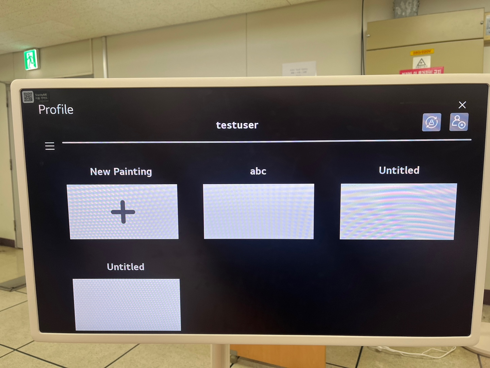

# **Test Document**

## **Introduction**
이 테스트 계획은 **Unit Test**, **Integration Test**, **System Test**의 단계를 통해 시스템의 정확성, 통합성, 기능성을 검증하고자 한다.

---

## **Positive and Negative Tests**
### **Positive Tests**
- **정상 입력**: 올바른 사용자 이름 및 비밀번호로 로그인.
- **정상 데이터**: 유효한 스케치 데이터 저장 및 불러오기.

### **Negative Tests**
- **비정상 입력**: 잘못된 비밀번호 입력 시 오류 메시지 표시.
- **비정상 데이터**: 스케치 저장 실패 시 적절한 오류 메시지 반환.
- **예외 처리**: AI 서버 응답 실패 시 기본 메시지 표시.

---

## **Test Scenarios and Cases**
### **FR01: 계정 관리**
#### **Test Scenario 1: 사용자 로그인**
| **Test ID**  | TC-FR01-01                        |
|--------------|-----------------------------------|
| **Description** | 사용자 이름과 비밀번호로 로그인 |
| **Test Type** | Unit Test, System Test           |
| **Inputs**    | username: `testuser`, password: `1234` |
| **Validation** | 로그인 성공 후 스케치 목록 표시 |
| **Expected Result** | "로그인 성공" 메시지와 목록 화면 전환 |

#### **Test Scenario 2: 새로운 계정 생성**
| **Test ID**  | TC-FR01-02                        |
|--------------|-----------------------------------|
| **Description** | 사용자 계정 생성 |
| **Test Type** | Unit Test, System Test |
| **Inputs** | username: `newuser`, password: `5678`, confirm password: `5678` |
| **Validation** | 입력 데이터의 유효성 검증 및 계정 생성 |
| **Expected Result** | "계정 생성 완료" 메시지 표시 |

#### **Test Scenario 3: 비밀번호 변경**
| **Test ID**  | TC-FR01-03                        |
|--------------|-----------------------------------|
| **Description** | 사용자 비밀번호 변경 |
| **Test Type** | Unit Test, System Test |
| **Inputs** | old password: `1234`, new password: `5678` |
| **Validation** | 기존 비밀번호와 일치 여부 및 새 비밀번호 유효성 검증 |
| **Expected Result** | "비밀번호 변경 완료" 메시지 |

### **FR02: 스케치 작업**
#### **Test Scenario 4: 스케치 저장**
| **Test ID**  | TC-FR02-01                        |
|--------------|-----------------------------------|
| **Description** | 사용자가 작업한 스케치를 저장 |
| **Test Type** | Integration Test, System Test |
| **Inputs** | 저장 버튼 클릭 |
| **Validation** | 스케치 데이터가 데이터베이스에 저장되는지 확인 |
| **Expected Result** | "저장 완료" 메시지 |

#### **Test Scenario 5: 스케치 삭제**
| **Test ID**  | TC-FR02-02                        |
|--------------|-----------------------------------|
| **Description** | 저장된 스케치를 삭제 |
| **Test Type** | Integration Test, System Test |
| **Inputs** | 삭제 버튼 클릭 |
| **Validation** | 데이터베이스에서 해당 스케치가 삭제 |
| **Expected Result** | "삭제 완료" 메시지 |

### **FR03: AI 기반 작업**
#### **Test Scenario 6: 제목 추천**
| **Test ID**  | TC-FR03-01                        |
|--------------|-----------------------------------|
| **Description** | AI가 스케치에 대한 제목 추천 |
| **Test Type** | Integration Test, System Test |
| **Inputs** | 스케치 저장 시 "제목 추천" 클릭 |
| **Validation** | AI 서버에서 제목 데이터 수신 및 표시 |
| **Expected Result** | 추천 제목 표시 |

#### **Test Scenario 7: 스케치 레퍼런스 요청**
| **Test ID**  | TC-FR03-02                        |
|--------------|-----------------------------------|
| **Description** | AI가 레퍼런스 이미지 생성 |
| **Test Type** | Integration Test, System Test |
| **Inputs** | 레퍼런스 요청 프롬프트 입력 |
| **Validation** | AI가 요청된 데이터를 바탕으로 이미지를 반환 |
| **Expected Result** | 생성된 레퍼런스 이미지 표시 |

---

## **Test Scenarios and Cases**
### **FR01: 계정 관리**
#### **Test Scenario 1: 사용자 로그인**

#### **Test Scenario 2: 새로운 계정 생성**

#### **Test Scenario 3: 비밀번호 변경**

### **FR02: 스케치 작업**
#### **Test Scenario 4: 스케치 저장**

#### **Test Scenario 5: 스케치 삭제**

### **FR03: AI 기반 작업**
#### **Test Scenario 6: 제목 추천**

#### **Test Scenario 7: 스케치 레퍼런스 요청**

---

